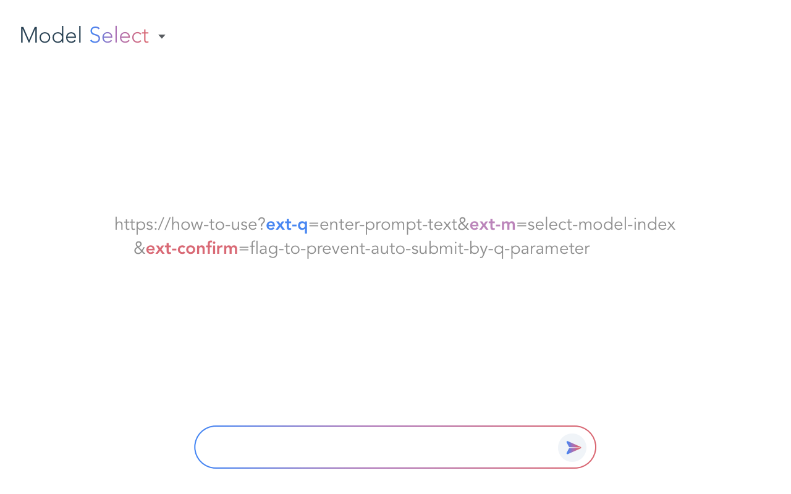

English | [日本語](README_ja.md)

# Prompt Runner for Google Gemini

This extension allows automatic execution of prompts, which is not supported by default, by passing additional URL parameters to the Google Gemini web app.



## Features

* Automatic prompt execution via URL parameters (parameters are not sent to the server and are processed securely within the browser)
  * Replacement of the keyword `{{clipboard}}` in prompts with clipboard text (optional)
  * Automatic prompt submission (optional)
* Model selection via URL parameters
* Generation of URLs usable in Prompt Runner for Google Gemini from the current prompt and selected model
* Copying of the last response when `Ctrl + C` / `Cmd + C` is pressed without text selection (requires a copy button, so a certain window size is necessary)

## Use Cases

* Register prompt templates in bookmarks
* Trigger prompt execution from CLI

## Supported Environments

* Google Chrome
* Microsoft Edge
* Opera
* Brave
* Arc
* Other Chromium-based browsers

## Install

### Chrome Web Store

* [Prompt Runner for Google Gemini](https://chromewebstore.google.com/detail/gmjljiibddnjnbllmddpplmnfhcddjmg)

### CRX File

1. Download the latest `.crx` file from the [Releases](https://github.com/mypicto/gemini-prompt-runner/releases/latest) page and save it locally.
2. Open the Chrome Extensions page (`chrome://extensions/`).
3. Enable "Developer mode" at the top right corner.
4. Drag and drop the downloaded `.crx` file into the browser window.
5. Click the "Add extension" button to complete the installation.

## Instructions

Use a **fragment** starting with `#` to specify parameters.
Do not use query parameters like `?key=value`; use `#key=value` instead.
Use `&` to separate multiple parameters.

```plaintext
https://how-to-use
    #ext-q=enter-prompt-text
    &ext-m=select-model
    &ext-clipboard=replace-keywords-in-prompt-with-clipboard-text
    &ext-send=auto-send-for-prompt

Ctrl+C / Cmd+C: copy the last answer.
```

| Parameter | Description | Value |
| --- | --- | --- |
| `ext-q` | Prompt string to execute | URL-encoded text (insert clipboard text with `{{clipboard}}` keyword) |
| `ext-m` | Index of the model to select | Integer starting from 0 (order as displayed in UI) or model name (as displayed in UI) |
| `ext-clipboard` | Replace the {{clipboard}} keyword in `ext-q` with the clipboard text | `true/false` or `0/1` |
| `ext-send` | Auto-sending for prompt | `true/false` or `0/1` |

> [!TIP]
> By enabling `ext-send` and specifying multiple `ext-q` values, you can send multiple prompts consecutively.

## Examples

* Ask for today's weather forecast

  ```url
  https://gemini.google.com/app#ext-q=Today%27s+weather+forecast.&ext-send=1
  ```

* Start a chat with the 3rd model

  ```url
  https://gemini.google.com/app#ext-m=2
  ```

* Start a chat with Deep Research model

  ```url
  https://gemini.google.com/app#ext-m=DeepResearch
  ```

* Summarize text from clipboard

  ```url
  https://gemini.google.com/app#ext-q=Summarize%20the%20input%20text.%0A%0A**Input%3A**%0A%7B%7Bclipboard%7D%7D&ext-clipboard=1

## Integration with the Mac Shortcuts App

By integrating with the Mac Shortcuts app, you can dynamically create and run prompts.

* [Prompt Runner for Google Gemini](https://github.com/mypicto/gemini-prompt-runner/raw/main/tools/mac/shortcuts/Prompt%20Runner%20for%20Google%20Gemini.shortcut)  
  Base shortcut.  
  Launches Prompt Runner for Google Gemini from the Shortcuts app, assuming your default browser has the extension installed.  

* [Today's weather forecast](https://github.com/mypicto/gemini-prompt-runner/raw/main/tools/mac/shortcuts/Today's%20weather%20forecast.shortcut)  
  Sample shortcut that asks for today’s weather forecast.  
  Requires the base Prompt Runner for Google Gemini shortcut to work.  

* [Summarize the input text in Gemini](https://github.com/mypicto/gemini-prompt-runner/raw/main/tools/mac/shortcuts/Summarize%20the%20input%20text%20in%20Gemini.shortcut)  
  Sample shortcut that summarizes the text in your clipboard.  
  Requires the base Prompt Runner for Google Gemini shortcut to work.  

## Attribution

Google Gemini™ is a trademark of Google LLC.
