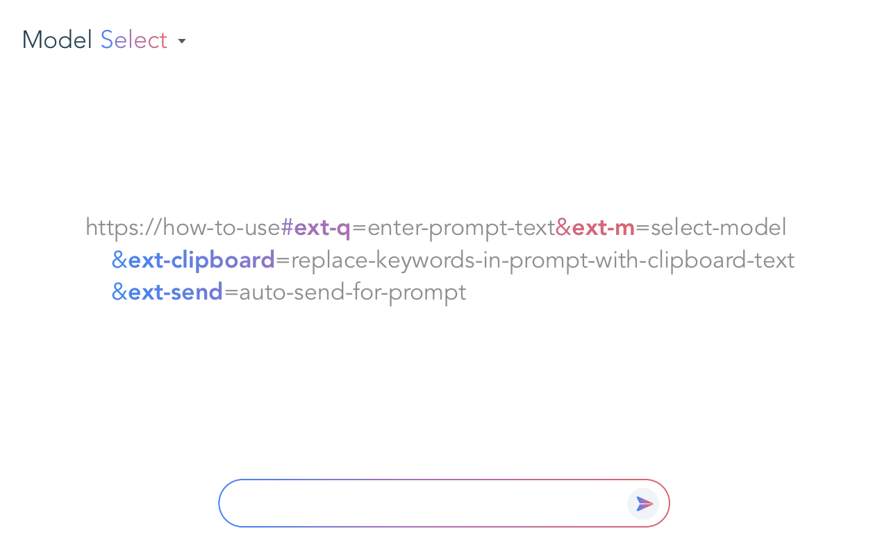

# Prompt Runner for Google Gemini

この拡張機能は、Google GeminiのWebアプリに追加のURLパラメータを渡せるようにすることで、標準では対応していないプロンプトの自動実行を可能にします。



## 機能

* URLのパラメータからプロンプトを自動実行（パラメータはサーバーに送信されず、ブラウザー内でセキュアに処理されます）
  * クリップボードのテキストをプロンプトに挿入（オプション）
  * プロンプトの自動送信を無効化（オプション）
* URLのパラメータからモデルの選択
* テキストを選択していない状態で `Ctrl + C` / `Cmd + C` キーを押すことで最後の回答をコピー

## 用途

* プロンプトのテンプレートをブックマークに登録
* CLIからプロンプト実行のトリガー

## 動作環境

* Google Chrome
* Microsoft Edge
* Opera
* Brave
* Arc
* 他、Chromium 派生のブラウザ

## インストール

### Chrome Web Store

* [Prompt Runner for Google Gemini](https://chromewebstore.google.com/detail/gmjljiibddnjnbllmddpplmnfhcddjmg)

### CRX ファイル

1. [Releases](https://github.com/mypicto/gemini-prompt-runner/releases/latest) から最新版の crx ファイルをダウンロードし、ローカルに保存。
2. Chromeで拡張機能を管理(`chrome://extensions/`) にアクセス
3. 右上の「デベロッパーモード」を有効にする
4. ダウンロードした crx ファイルをブラウザにドラッグ&ドロップ
5. 拡張機能を追加ボタンを押下

## 操作方法

```plaintext
https://how-to-use
    ?ext-q=enter-prompt-text
    &ext-m=select-model
    &ext-clipboard=flag-to-replace-clipboard-text-in-q-parameter
    &ext-confirm=flag-to-prevent-auto-submit-by-q-parameter

Ctrl+C / Cmd+C: copy the last answer.
```

| パラメータ | 説明 | 値 |
| --- | --- | --- |
| `ext-q` | 実行するプロンプト文字列 | URLエンコードされたテキスト（`{{clipboard}}`キーワードでクリップボードのテキストを挿入） |
| `ext-m` | 選択するモデルのインデックス | 0 から始まる整数（UI上での表示順）またはver1.1.0以降ではモデル名（UI上での表示名） |
| `ext-clipboard` | `ext-q`の中で`{{clipboard}}`キーワードをクリップボードのテキストと置き換えます | `true/false` または `0/1` |
| `ext-confirm` | `ext-q`パラメータによる自動送信の抑制 | `true/false` または `0/1` |

## サンプル

* 今日の天気予報を質問

  ```url
  https://gemini.google.com/app?ext-q=%E4%BB%8A%E6%97%A5%E3%81%AE%E5%A4%A9%E6%B0%97%E4%BA%88%E5%A0%B1%E3%80%82
  ```

* 2番目のモデルでチャットを開始

  ```url
  https://gemini.google.com/app?ext-m=1
  ```

* Deep Research モデルでチャットを開始

  ```url
  https://gemini.google.com/app?ext-m=DeepResearch
  ```

* クリップボードのテキストを要約する

  ```url
  https://gemini.google.com/app?ext-q=%E5%85%A5%E5%8A%9B%E3%81%95%E3%82%8C%E3%81%9F%E3%83%86%E3%82%AD%E3%82%B9%E3%83%88%E3%82%92%E8%A6%81%E7%B4%84%E3%81%99%E3%82%8B%E3%80%82%0A%0A%2A%2AInput%3A%2A%2A%0A%7B%7Bclipboard%7D%7D&ext-clipboard=1&ext-confirm=1
  ```

## Mac ショートカットアプリとの連携

Mac ショートカットアプリと連携させることで、プロンプト動的に作成して実行することができます。

* [Prompt Runner for Google Gemini](https://github.com/mypicto/gemini-prompt-runner/raw/main/tools/mac/shortcuts/Prompt%20Runner%20for%20Google%20Gemini.shortcut)  
  ベースのショートカット。  
  Prompt Runner for Google Gemini拡張機能をインストールしているのがデフォルトブラウザの場合に、ショートカットアプリからPrompt Runner for Google Geminiを呼び出します。 
 
* [Today's weather forecast](https://github.com/mypicto/gemini-prompt-runner/raw/main/tools/mac/shortcuts/Today's%20weather%20forecast.shortcut)  
  今日の天気予報を質問するサンプル。  
  実行には別途 Prompt Runner for Google Gemini ショートカットが必要です。  

* [Summarize the input text in Gemini](https://github.com/mypicto/gemini-prompt-runner/raw/main/tools/mac/shortcuts/Summarize%20the%20input%20text%20in%20Gemini.shortcut)  
  クリップボードのテキストを要約するサンプル。  
  実行には別途 Prompt Runner for Google Gemini ショートカットが必要です。  

### 帰属

Google Gemini™ は Google LLC の商標です。
